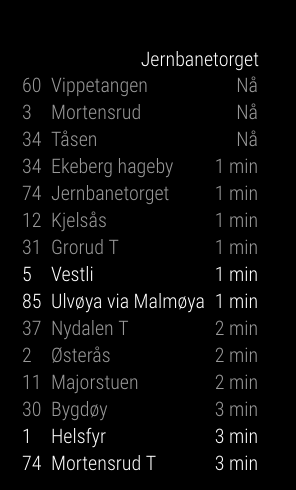
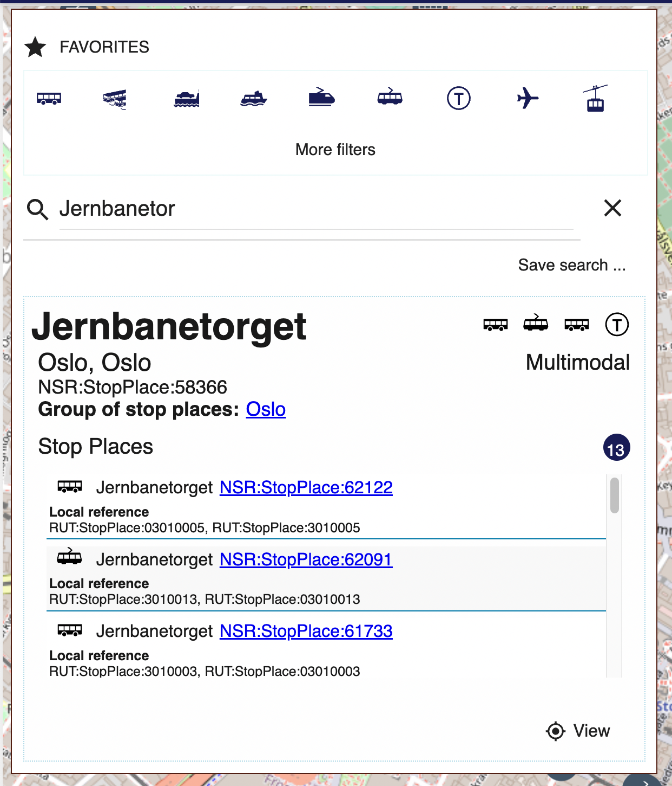
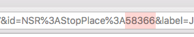

# MMM-Entur-tavle

 This is a departure board made for [MagicMirror²](https://magicmirror.builders/) using the [Entur API](https://developer.entur.org). The board can show the next departures for all public transport in Norway including any mode of transportation.

## Emergency update notice

Has your departure board recently stopped working? Entur recently EOL-ed their old API, and old installations broke. Please update your installation of MMM-Entur-tavle.

## Installation

Enter your MagicMirror² module folder, e.g.:

```bash
    cd ~/MagicMirror/modules
```

Clone the repository:

```bash
    git clone https://github.com/Arve/MMM-Entur-tavle
```

Add the departure board to your configuration file, for instance:

```js
{
    module: "MMM-Entur-tavle",
    position: "top_right",
    config: {
        stopId: '58366',
        stopType: 'StopPlace',
        numResults: 5,
        showHeader: true,
        highlightRealtime: true,
        timeOffset: [5, 'minutes'],
        exclusions: [ 'a1', 'a2', 'a3' ],
    }
},
```

## Configuration

Configuration options are as follows:

| Option | Description | Default value |
|-------------------|-----------------------------------------------------------------------------------------------------------------------------------------------------------------------------------------------------------------------------------------------------------------------------------------------------------------|---------------|
| stopId | String.  A valid ID for a stop or quay (platform) from Entur's directory of stopPlaces. You can either query for this through their GraphQL IDE, or extract the stopId from the query string generated when searching for a departure-board on [https://en-tur.no](https://en-tur.no). See documentation below | "12345" |
| stopType | Chooses whether the place you are querying in stopId is a StopPlace or a quay.,A quay can for instance be a specific platform on a stopPlace - such as buses departing in a specific direction. Valid values are "StopPlace" and "Quay" (case sensitive). See separate documentation on stopType below. | "StopPlace" |
| numResults | Integer.  The maximum number of results of to be returned from the query. | 5 |
| showHeader | Boolean.  Whether to show the name of the stop or quay above the list of departures from the stop. | true |
| highlightRealtime | Boolean.  If set to `true`, departures that are updated with realtime info will be slightly bolded. | false |
| updateSpeed | Integer.  The transition speed when updating the display | 1000 |
| size | String.  One of "xsmall", "small", "medium", "large" or "xlarge" | "medium" |
| refresh | Integer.  Seconds between board refresh | 30 |
| showTransportMode | Boolean. Show the transport mode as an icon. | false |
| timeOffset | Array(int, string). How much into the future to offset a query.  For instance, setting `[10, "minutes"] will only give responses 10 minutes from "now". The array provided must be valid _array_ syntax for [moment.duration()](https://momentjs.com/docs/#/durations/). | [0, 'seconds']
| exclusions | Array(string).  Public codes to exclude from display. For instance, `exclusions: [ 'a2', 'a4' ]` will exclude departures whose public code is 'a2' and 'a4'.  Note that this may mean that you get fewer results than those specified in the `numResults` config, so specifying this value may mean that you want to alter the numResults value until you get a satisfactory number of results. | []
| whiteListedTransportModes | Array(string). If set will only display the given transport modes. For instance, `whiteListedTransportModes: [ 'tram', 'metro' ]` will only display trams and metros. Possible values are "bus", "rail", "metro", "pram", "coach".  numResults works as expected. | []

## Finding stopPlace

There are two means to find a stop place

## Using Entur's national Stop Place Registry

1. Visit <https://stoppested.entur.org>
2. Query for your desired stop place
3. Once found, look for the stop place or quay ID in the search results.
4. Stop places are listed as `NSR:StopPlace:[number]`, for instance `NSR:StopPlace:58366`
5. Platforms/Quays are listed below, as `NSR:Quay:[number]`, for instance `NSR:Quay:7158`



## Using the Entur web interface

You can alternatively locate your stopPlace or quay with a query on the [Entur web interface](https://en-tur.no/):

1. Click on "Avgangstavle"
2. Search for your stop and select it from the dropdown
3. Inspect the browser's address bar.  Look for the `id` query parameter
4. Look for the numeric ID following `StopPlace%3A` -  and extract it.

## Use of stopType

In the Entur/Journeyplanner API, a `stopPlace` can be an area where there are multiple platforms and modes of transporation within a limited geographical area (or it could simply be different platforms on the same stop).  In the case where you want to query a specific quay/platform instead of an entire stopPlace, set the value of `stopType` to `Quay`.

To get the specific quay, you will probably want to extract it from the GraphQL IDE. You can use [this query](https://api.entur.io/journey-planner/v2/ide/?query=%7B%0A%20%20stopPlace(id%3A%20%22NSR%3AStopPlace%3A58366%22)%20%7B%0A%20%20%20%20id%0A%20%20%20%20name%0A%20%20%20%20estimatedCalls(timeRange%3A%2072100%2C%20numberOfDepartures%3A%2010)%20%7B%0A%20%20%20%20%20%20quay%20%7B%0A%20%20%20%20%20%20%20%20id%0A%20%20%20%20%20%20%7D%0A%20%20%20%20%20%20destinationDisplay%20%7B%0A%20%20%20%20%20%20%20%20frontText%0A%20%20%20%20%20%20%7D%0A%20%20%20%20%20%20serviceJourney%20%7B%0A%20%20%20%20%20%20%20%20journeyPattern%20%7B%0A%20%20%20%20%20%20%20%20%20%20line%20%7B%20%20%0A%20%20%20%20%20%20%20%20%20%20%20%20transportMode%0A%20%20%20%20%20%20%20%20%20%20%20%20publicCode%0A%20%20%20%20%20%20%20%20%20%20%7D%0A%20%20%20%20%20%20%20%20%7D%0A%20%20%20%20%20%20%7D%0A%20%20%20%20%7D%0A%20%20%7D%0A%7D).

Replace the numeric part of the stopPlace ID (`NSR:StopPlace:56338`) with your own stopPlace's numeric id and run the query. In the right-hand window, you will have a number of departures from that stopPlace, and each of the results will have sections similar to the following:

```json
"quay": {
    "id": "NSR:Quay:7184"
},
"destinationDisplay": {
    "frontText": "Vestli via Majorstuen"
},
```

… look for the quay number that corresponds to the frontText of the quay/platform you wish to display travels from.

## Multiple instances

This plugin fully supports multiple instances on the same MagicMirror² instance. If you wish to display different platforms separately, use the stopType configuration option with separate quays as suggested above.

## Disclaimer

This module fetches data licensed under the [Norwegian License for open Government Data (NLOD)](https://data.norge.no/nlod/en) delivered by [Entur](https://www.entur.org/), but the application/module itself is not developed, maintained or endorsed by Entur.

## Planned features

* Localization
* If other travel authorities offer access to the same GraphQL-based API: Add support for these as well. If you know of any such, please file an issue.

## Developer

Run `npm install` to install devDependencies like ESLint.

Run `npm run lint:fix` to check code and fix linting issues.
